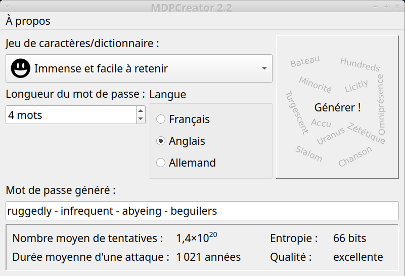

# MDPCreator

Password generator application based on Qt (C++) and packaged under the Debian
standards.

Different levels of security are offered, from lower-case letters only to a mix
of lower-, upper-case letters, digits and special characters. Keep in mind that
entropy is not greatly improved by adding special characters to the set of
lower-, upper-case letters and digits; best is to increase the numbers of
characters in the password.

The bottom option in the drop-down menu generates passphrases with words taken
from a French or English dictionary, containing about 90K and 130K words
respectively.
This can produce passphrases that are stronger and easier to remember than
sequences of random symbols.

The random number generator used by MDPCreator is the "system's
cryptographically-safe random generator. On Unix systems it is equivalent to
reading from `/dev/urandom`." (excerpt from Qt's documentation)

Currently the app interface is offered in French only. Below is a snapshot
showing an example using the latest feature available in the app, which
creates secure and easy-to-remember passwords:

